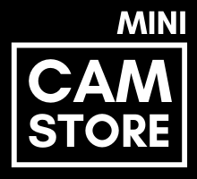

    

        
    

> Estudo sobre e-commerce com Vanilla JS.

## Overview
O Mini CamStore é um **e-commerce** de camêras fotográficas novas e usadas, analógicas e digitais. Dito isso, esse é um projeto para estudos desenvolvido com **Vanilla JS, HTML e CSS** afim de aprender e aprimorar conhecimentos sobre e-commerce.

## Next Steps
- [ ] Checkout e finalização de uma compra. 
- [ ] Detalhes de um produto.
- [ ] Feedback ao adicionar produto no carrinho.
- [ ] Sessão de compras.

## Deploy
Enquanto possível o deploy do projeto está sendo feito com o *github-pages* e está disponível [aqui](https://lucasbecker.github.io/mini-camstore/).

## License
[MIT License](./LICENSE) © [Lucas Becker](http://lucasbecker.github.io/)